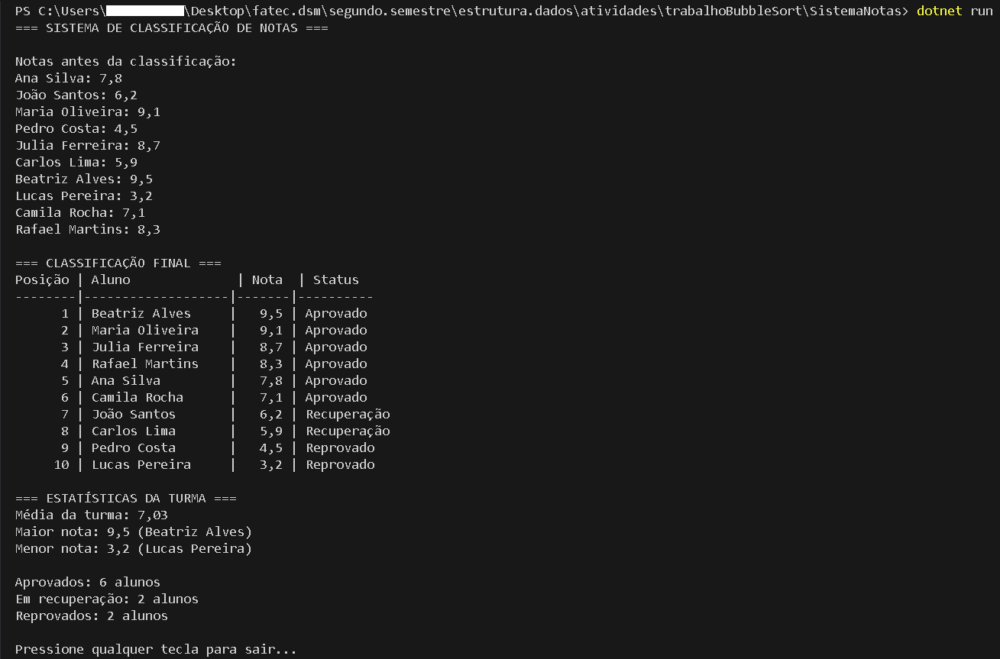

# Sistema de Classificação de Notas com Bubble Sort

Este é um sistema simples em **C#** para classificar alunos com base em suas notas.  
O programa ordena os alunos em ordem decrescente de nota e exibe a classificação final, além de estatísticas da turma.

---

## Funcionalidades
- Ordenação das notas usando **Bubble Sort**.  
- Exibição da classificação final com posição, nome, nota e status:  
  - **Aprovado** (nota >= 7.0)  
  - **Recuperação** (nota entre 5.0 e 6.9)  
  - **Reprovado** (nota < 5.0)  
- Cálculo de estatísticas da turma:
  - Média da turma  
  - Maior nota  
  - Menor nota  
  - Quantidade de aprovados, em recuperação e reprovados  

---

## Estrutura do Projeto
    ```
    SistemaNotas/
    │-- Program.cs
    │-- SistemaNotas.csproj
    │-- README.md
    │-- imgs/
    │-- saida.png
    ```

---

## Como executar

### Pré-requisitos
- [.NET SDK](https://dotnet.microsoft.com/pt-br/download) instalado na sua máquina
- Visual Studio Code (ou outro editor de sua preferência)

### Passos
1. Clone o repositório:
   ```
   git clone https://github.com/SEU-USUARIO/SistemaNotas.git
   ```
2. Entre na pasta do projeto:
   ```
   cd SistemaNotas
   ```

3. Execute o projeto:
   ```
   dotnet run
   ```
Exemplo de saída
  


Tecnologias utilizadas
   ```
   C#

   .NET Console
   ```
**Autores**
   ```
   Projeto desenvolvido por:

   Caio, Carlos, João e Geovanny.
   ```

---